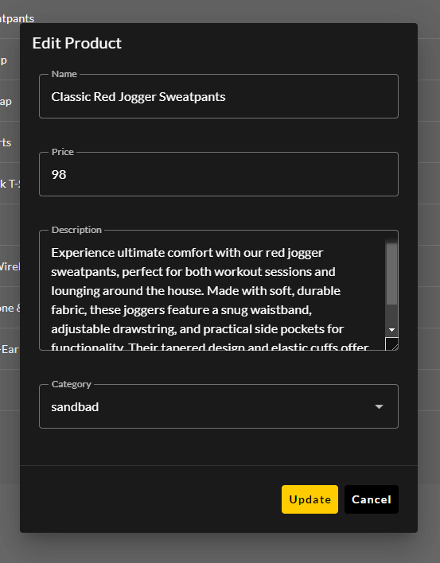

 
# NEEBLY - E-commerce CMS app

Welcome to **NEEBLY**, an e-commerce Content Management System (CMS) that allows store admins to manage products, categories, orders, and more. This document provides guidance on using the Products management page in the CMS.


## Table of Contents
- [Introduction](#introduction)
- [Installation](#installation)
- [Features](#features)
- [Managing Products](#managing-products)
  - [Adding a New Product](#adding-a-new-product)
  - [Editing a Product](#editing-a-product)
  - [Deleting a Product](#deleting-a-product)
  - [Using Filters and Search](#using-filters-and-search)
- [Contributing](#contributing)
- [Implemented Components](#implemented-components)
- [License](#license)

## Introduction

**NEEBLY CMS** is designed to allow store owners and admins to manage their product catalogs with ease. Using **Vuetify 3** components for UI and **TailwindCSS** for layout styling, the CMS provides a responsive and user-friendly interface.

## Installation

1. Clone the repository: 
   ```bash
   $ git clone https://github.com/kreativjamesz/neebly-app.git

   $ cd neebly-app
   ```

2. Install dependencies:
   ```bash
   npm install
   ```

3. Start the development server:
   ```bash
   npm run dev
   ```

4. Open the CMS in your browser by visiting `http://localhost:3000/admin`.

## Features

- Admin dashboard with Vue 3, Vuetify 3, and TailwindCSS.
- Product management (Add, Edit, Delete).
- Product filtering and search capabilities.
- Reusable, modular UI components with Vuetify.

## Managing Products

### Adding a New Product

1. Navigate to the **Products** page via the sidebar.
2. Click the **Add New Product** button, which opens a form modal built with Vuetify.

   

3. Fill out the product details (e.g., name, price, description, and category) using Vuetify’s form inputs and TailwindCSS for layout.

   

4. Click **Save** to add the product. The product will immediately appear in the product list.

### Editing a Product

1. On the **Products** page, find the product you want to edit and click the **Edit** icon.

   

2. A modal will open with the existing product data. Make your changes and click **Save**.

   

3. Your changes will be reflected in the list after the page refreshes.

### Deleting a Product

1. To delete a product, click the **Delete** icon next to the product you wish to remove.

   

2. A confirmation dialog will appear. Click **Confirm** to delete the product from your catalog.

   

### Using Filters and Search

The **Products** page has filtering and search features to help you manage a large catalog:

1. Use the **Search Bar** at the top to find products by name, SKU, or category.

   

2. Apply filters using Vuetify's filter components, allowing you to narrow down products by price range, stock status, or category.

   

3. The product list updates dynamically based on your search and filter options.

## Contributing

To contribute to **NEEBLY CMS**, please fork the repository and submit a pull request. Contributions are always welcome, whether you’re improving the UI, adding new features, or fixing bugs.

## Implemented Components:

- **VUserMenu**: *Dropdown menu for authenticated users.*
- **VThemeToggle**: *Toggles between light and dark themes.*
- **VMainToast**: *Reusable notification component.*
- **VMainNavigationDrawer**: *Main navigation drawer for the CMS.*
- **VMainNavigationBar**: *Main navigation bar for the CMS.*
- **VMainConfirmation**: *Confirmation dialog for the CMS.*
- **VAppButton**: *Reusable, themed button component.*
- **VCategoriesTable**: *Data table for verifying if a category exists.*

### Dialogs consist of reusable components:
- **VActivatorDialog**
- **VConfirmationDialog**
- **VMainDialog**
- **VModalDialog**

### The ***Products*** directory contains component modules for product-related tasks:
- **VAddProduct**: *Initiates the add product flow.*
- **VCategoryFilter**: *Allows category selection.*
- **VPriceFilter**: *Filters products by price using Vuetify 3's v-slider component.*
- **VProductForm**: *Add/Edit form for products.*
- **VProductsCardList**: *Optional feature to display products using cards.*
- **VProductsDataTable**: *Displays products in a data table using a server-side component.*
- **VProductView**: *Displays individual product details.*
- **VSearchProduct**: *Enables product search using a TextField.*

## License

This project is licensed under the MIT License. See the [LICENSE](./LICENSE) file for more details.
